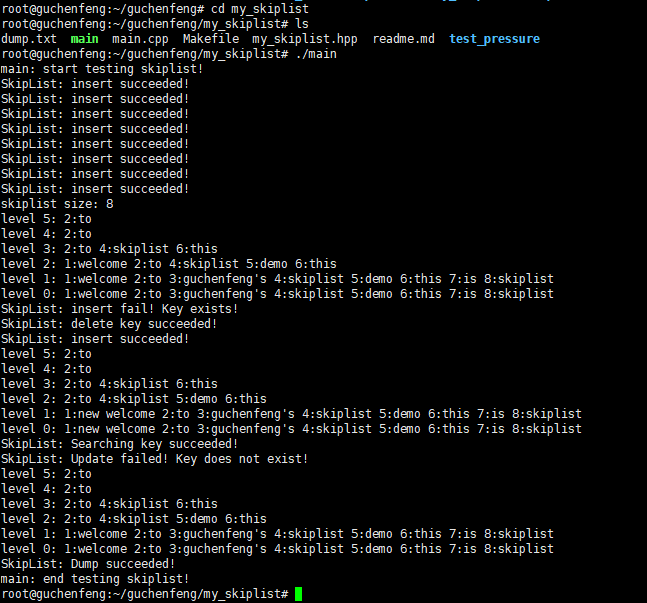
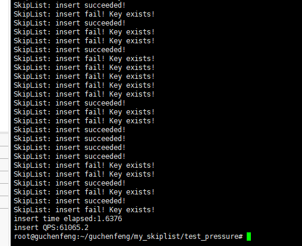

# My_Skiplist

个人博客：https://chanphonggu.github.io

> 仿redis的KV跳表实现，主要功能有：增删查改、数据落盘、数据读盘。

## 开发环境

- ubuntu 20.04 (1核2GB)
- c++11

## demo演示

## 提供接口

- insert：插入KV数据，返回bool。
- remove：删除KV数据，返回bool。
- find：查找KV数据，返回V。
- update：更新KV数据，返回bool。
- load：数据读盘初始化，返回bool。
- dump：数据落盘，返回bool。
- display：跳表数据打印，返回bool。
- size：跳表元素个数，返回int。

## 设计思路

> 跳表从大体来说属于多层链表，一个节点可以横跨多个层，拥有多个层的层指针（该指针指向该层的下一个节点），所以有多少个数据就会有多少个节点，只是节点的层指针数不一样。

- **插入操作**：从高层遍历至低层获取待插入节点每一层（每一层指该节点的层数中的层）的插入位置，然后插入。
- **删除操作**：从高层遍历至低层获取待删除节点每一层（每一层指该节点的层数中的层）的前继节点位置，然后修改前继节点指向，最后释放删除结点内存。
- **修改操作**：从高层遍历至低层获取待删除节点每一层（每一层指该节点的层数中的层）的前继节点位置，然后修改节点数值。
- **查询操作**：从高层遍历至0层获取查询节点的前继节点位置，若存在则查询成功，若不存在则失败。本项目中会查询到0层，也**可以自行在高层至低层的遍历过程中增加判断**，**这样若存在则可以不用查询到0层**。本项目为了实现增删改查操作的代码统一，没有增加这个判断。

- **落盘与读盘操作**：包含节点KV值编解码以及文件fstream读写流操作，编码格式为: `K:V`。

## 压力测试

测试思路是生成多个线程，每个线程向跳表进行插入或者查询操作，然后取得所花费的时间，进而计算QPS。
本轮测试插入请求`100000`个，QPS为`61065`。其中失败的是因为key已经存在，但请求已得到处理。

## 文件介绍

- test_pressure ：压测文件夹，含有压力测试文件。

- my_skiplist.hpp ：跳表的实现头文件，需要跳表时候include即可。

- main.cpp：跳表使用的demo。

- Makefile：编译脚本

- readme.md：中文介绍

  

